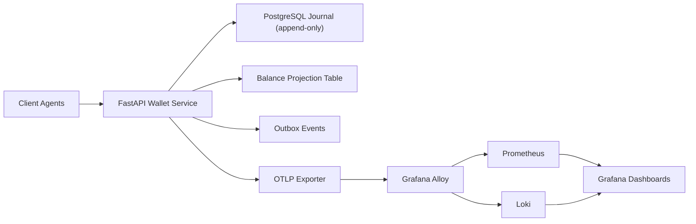

# Agentic Commerce Wallet Service

A CP-first, double-entry wallet ledger service for agentic commerce infrastructure.

## Architecture



### Ledger Model
- `journal_transactions` holds immutable committed transactions with idempotency metadata.
- `journal_entries` stores signed postings (debit/credit), append-only.
- `balance_projections` is derived state updated transactionally when journal commits.
- `outbox_events` emits durable domain events for downstream consumers.

### Invariants
- At least two entries per transaction.
- Sum of entries per transaction is exactly zero.
- Entry asset must match account asset.
- Idempotency keys are mandatory for all write endpoints.

## API Overview
- `POST /v1/wallets`
- `GET /v1/wallets/{wallet_id}/balance`
- `GET /v1/wallets/{wallet_id}/balance/audit`
- `POST /v1/transfers`
- `POST /v1/adjustments`
- `GET /v1/transactions/{transaction_id}`
- `GET /v1/health`
- `GET /v1/ready`

## Auth Model
- Bearer JWT required.
- Required claims: `sub`, `aud`, `exp`, `scope`.
- Supported scopes:
  - `wallet:read`
  - `wallet:write`
  - `wallet:admin`

## Local Setup (PostgreSQL already running)

1. Install dependencies:
```bash
uv sync --extra dev
```

2. Bootstrap DB and apply migrations:
```bash
./scripts/bootstrap_db.sh
```

3. Run service:
```bash
./scripts/run_dev.sh
```

4. Run tests:
```bash
./scripts/test.sh
```

### Environment Variables
- `DATABASE_URL` (default: `postgresql://raj@localhost:5432/wallet_service`)
- `JWT_SECRET` (default: `dev-secret-change-me`)
- `JWT_AUDIENCE` (default: `agentic-commerce`)
- `OTEL_EXPORTER_OTLP_ENDPOINT` (default: `http://localhost:4318`)
- `SYSTEM_WALLET_ID` (default: `00000000-0000-0000-0000-000000000001`)

## Quick API Example

```bash
TOKEN="$(python - <<'PY'
import jwt, time
secret='dev-secret-change-me'
payload={'sub':'demo','aud':'agentic-commerce','scope':'wallet:read wallet:write wallet:admin','exp':int(time.time())+3600}
print(jwt.encode(payload, secret, algorithm='HS256'))
PY
)"

curl -X POST http://localhost:8080/v1/wallets \
  -H "Authorization: Bearer $TOKEN" \
  -H "Content-Type: application/json" \
  -d '{"wallet_id":"11111111-1111-1111-1111-111111111111","asset":"USD"}'
```

## Load Tests and Synthetic Traffic (k6)

### Install k6
```bash
./scripts/install_k6.sh
```

### Seed wallets for load profile
```bash
uv run python scripts/seed_wallets.py --count 3000
```

### Run full load suite
```bash
./scripts/run_load_suite.sh
```

### Run resiliency suite (with fault injection)
```bash
./scripts/run_resiliency_suite.sh
```

### Included scenarios
- `load/k6/smoke.js`: basic correctness + thresholds.
- `load/k6/baseline.js`: steady 1k tx/s target and p95 < 150ms threshold.
- `load/k6/spike.js`: burst pressure and recovery behavior.
- `load/k6/soak.js`: long-run reliability and mixed read/write.
- `load/k6/resiliency_partition.js`: expected CP fail-closed behavior (200 or 503).

### Reliability pass criteria
- p95 write latency < 150ms in baseline.
- No double-entry invariant violations.
- No duplicate committed effects for repeated idempotency keys.
- During DB partition/outage windows, writes fail with 503 (fail-closed).

## Observability: OpenTelemetry + Alloy + Prometheus + Loki + Grafana

Service emits OTLP traces/metrics/logs to Alloy.

- Alloy config: `deploy/doks/observability/alloy/config.alloy`
- Prometheus config: `deploy/doks/observability/prometheus/prometheus.yml`
- Alert rules: `deploy/doks/observability/prometheus/alerts.yml`
- Loki config: `deploy/doks/observability/loki/loki-config.yaml`

### Grafana dashboards
Seed dashboard spec: `deploy/doks/observability/grafana/dashboards.json`

Recommended dashboard panels:
- Request rate and p95 latency
- Error rate (5xx)
- Transaction commit throughput
- Idempotency conflict rate
- DB availability/readiness health

## Deployment

## DigitalOcean Kubernetes (DOKS) - Primary

1. Build and push image:
```bash
docker build -t ghcr.io/<org>/wallet-service:latest .
docker push ghcr.io/<org>/wallet-service:latest
```

2. Deploy wallet chart:
```bash
helm upgrade --install wallet-service deploy/doks/helm/wallet-service \
  --set image.repository=ghcr.io/<org>/wallet-service \
  --set image.tag=latest \
  --set secretEnv.JWT_SECRET='<secure-secret>'
```

3. Deploy observability stack components (Alloy/Prometheus/Loki/Grafana) using the configs under `deploy/doks/observability`.

4. Validate:
```bash
kubectl get pods
kubectl port-forward svc/wallet-service 8080:8080
curl http://localhost:8080/v1/ready
```

## Droplet Container Runtime - Secondary

```bash
cd deploy/droplet
docker compose up --build
```

Service becomes available at `http://localhost:8080`.

## CI/CD Quality Gates
CI workflow: `.github/workflows/ci.yaml`
- Installs via `uv`.
- Runs full pytest suite against PostgreSQL service.

Recommended release gate extension:
1. Unit + integration + reliability tests pass.
2. k6 smoke and baseline pass threshold checks.
3. Deployment proceeds only when gates pass.

## CAP and Reliability Notes
- Write APIs prioritize consistency and fail closed when DB is unavailable.
- No accepted writes during partition if durable state cannot be guaranteed.
- Service is stateless and horizontally scalable; PostgreSQL is source of truth.
- Balance projection can be audited against journal using `/balance/audit`.
